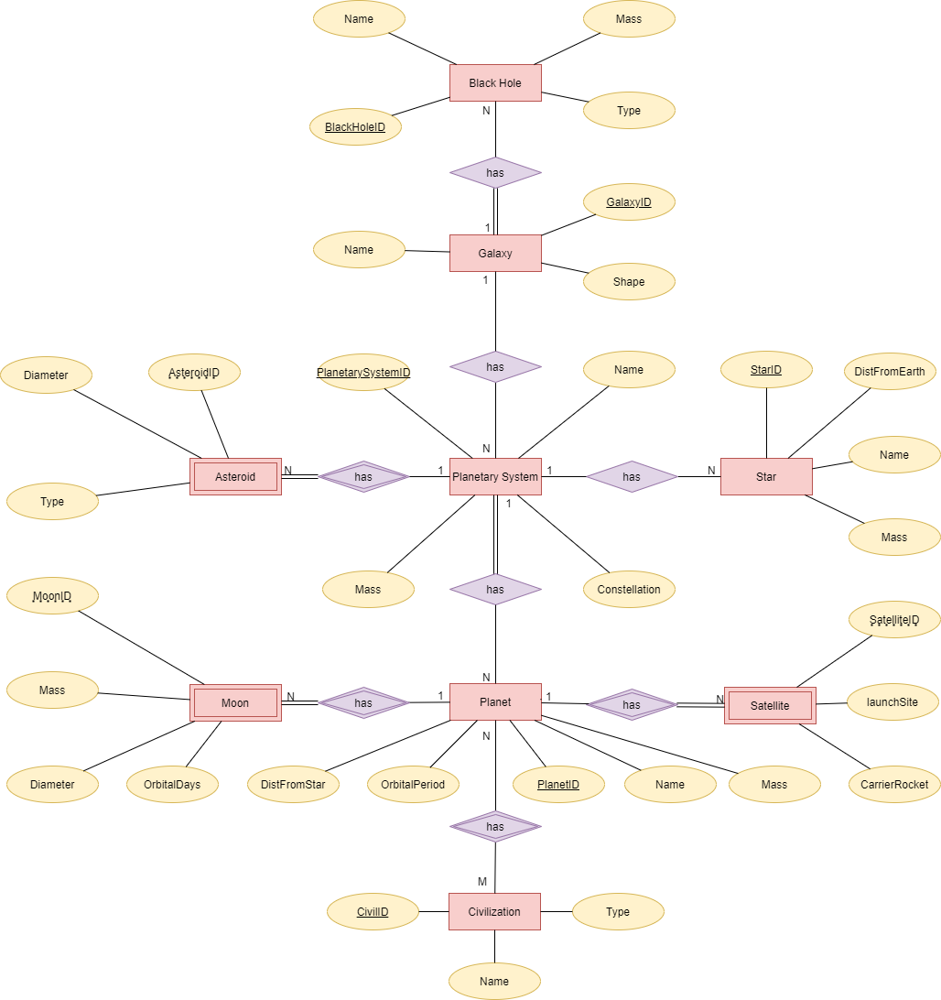
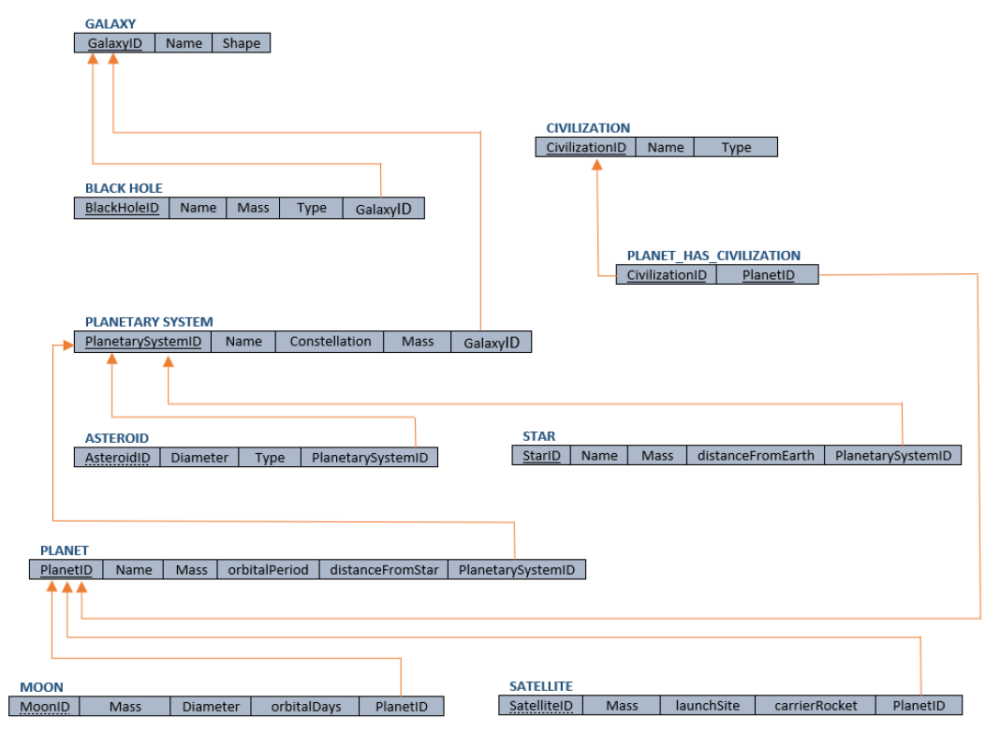
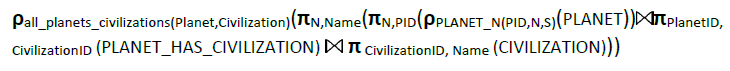
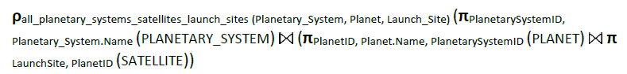
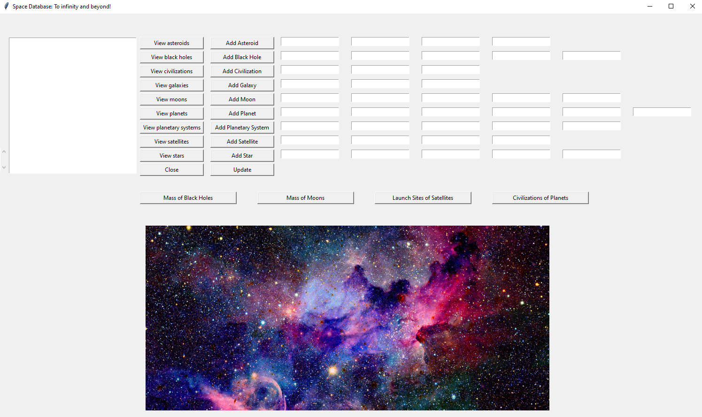
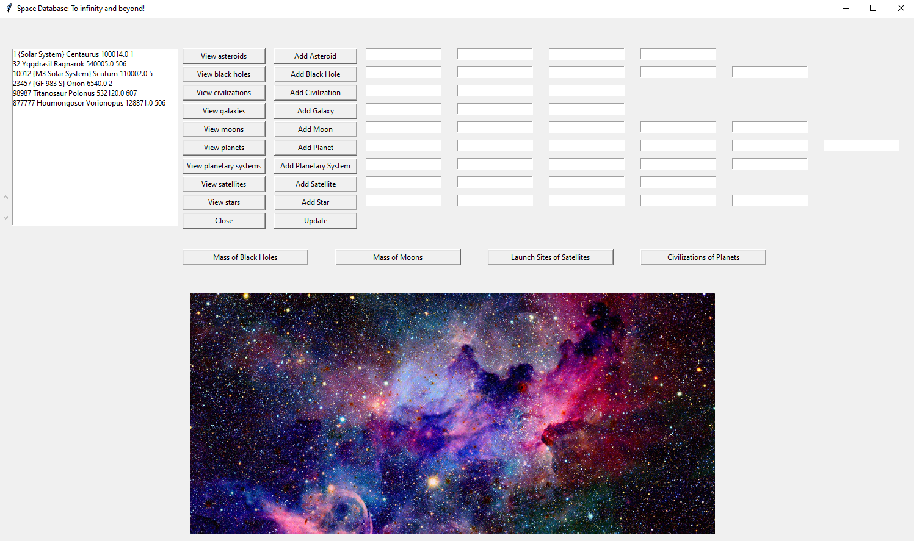
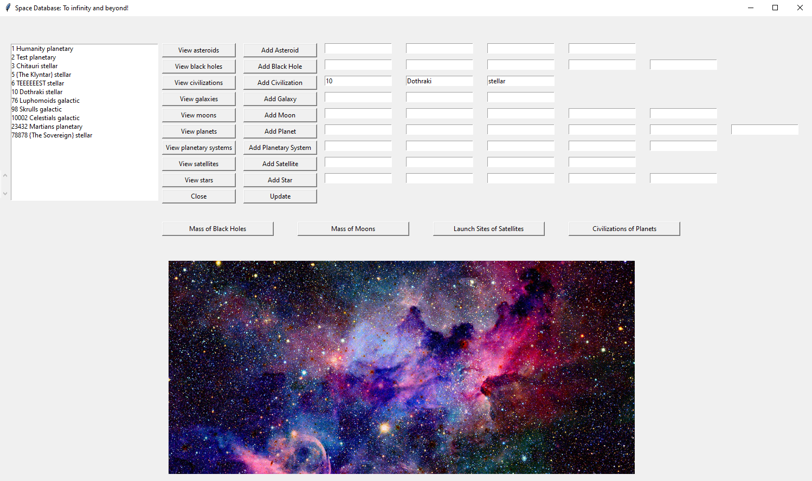

# Data Bases

This repository contains the assignments for the Academic Courses "Data Bases" taught in the Fall of 2020-2021 in  Electrical and Computer Engineering Department of Aristotle University of Thessaloniki.

The purpose of this project is the familiarization with **MySQL Programming Language** through the development of an **friendly-to-user Application**. The work is divided into three deliverables, which are responsible for designing the database, implement it in MySQL Workbench  and developing a backend, as well as a front end in **Python**. 

### 1. Designing the database

**SpaceDB** will store information about galaxies, black holes, civilizations, asteroids, planetary systems, planets, stars, natural and artificial satellites. This application, therefore, takes care not only to inform a user who would like to know what is there in the universe, but at the same time to motivate researchers to register the findings of their work.

Potential users of the application are defined below:

- Admin: Control Users, read and edit data
- Researcher: Read and edit data
- Simple User: Read-only data

The entities are the Galaxy, the Black Hole, the Civilization, the Planetary System, the Star, the Planet, the Natural Satellites (Moon) and the artificial satellites (Satellite).

#### 1.1 Entity-Relationship model

    

---

#### 1.2. Relational Model

    

---

#### 1.3. Views

- Names of planets and civilizations in them:

    

---

- Mass of moons:

  

      
  

  ---

- Names and mass of black holes and their galaxies:

    

---

- Names of planetary systems, their planets and launch sites of their satellites:

  

      
  

---

#### 1.4. Tables of data

**Galaxy:**

| GalaxyID | Name             | Shape      |
| -------- | ---------------- | ---------- |
| 0001     | Milky Way        | Spiral     |
| 0002     | Andromeda Galaxy | Spiral     |
| 0005     | Whirlpool Galaxy | Spiral     |
| 0102     | IC 1101          | Elliptical |
| 0506     | Carina dwarf     | Irregular  |
| 0607     | NGC 7814         | Spiral     |
| 1002     | NGC 1375         | Lenticular |

 

**Black Hole:** (Mass in solar mass unit)                       

| BlackHoleID | Name          | Mass | Type         | GalaxyID |
| ----------- | ------------- | ---- | ------------ | -------- |
| 42042       | HR 6819       | 6.3  | intermediate | 1        |
| 42043       | A0620-00      | 11.3 | supermassive | 1        |
| 42044       | XTE J1118+480 | 6.5  | intermediate | 1        |
| 42045       | Gargantua     | 6.7  | intermediate | 2        |
| 42046       | GRO J0422+32  | 3.97 | miniature    |          |
| 42047       | Cygnus X-3    | 10.3 | stellar      | 1        |

 

**Civilization**:

| CivilizationID | Name          | Type      |
| -------------- | ------------- | --------- |
| 5              | The Klyntar   | stellar   |
| 1              | Humanity      | planetary |
| 10002          | Celestials    | galactic  |
| 23432          | Martians      | planetary |
| 3              | Chitauri      | stellar   |
| 76             | Luphomoids    | galactic  |
| 98             | Skrulls       | galactic  |
| 78878          | The Sovereign | stellar   |

 

**Planetary System:** (mass in solar mass)                        

| PlanetarySystemID | Name            | Mass    | Constellation |
| ----------------- | --------------- | ------- | ------------- |
| 1                 | Solar System    | 1.00014 | Centaurus     |
| 32                | Yggdrasil       | 54.0005 | Ragnarok      |
| 10012             | M3 Solar System | 11.0002 | Scutum        |
| 23457             | GF 983 S        | 6.54    | Orion         |
| 877777            | Houmongosor     | 128.871 | Vorionopus    |
| 98987             | Titanosaur      | 532.12  | Polonus       |

 

**Asteroid:** (diameter in km)

| AsteroidID | Name          | Diameter | Type      | PlanetarySystemID |
| ---------- | ------------- | -------- | --------- | ----------------- |
| 90821      | 1 Ceres       | 939      | Chondrite | 1                 |
| 90822      | 4 Vesta       | 525      | Chondrite | 10012             |
| 87654      | 2 Pallas      | 512      | Chondrite | 10012             |
| 43543      | 10 Thodor     | 434      | Chondrite | 32                |
| 23233      | 15 Eunomia    | 268      | Stony     | 1                 |
| 23235      | 451 Patientia | 254      | Other     | 32                |

 

**Star:** (distance in light years)                                                                 

| StarID | Name             | Mass   | distanceFromEarth | PlanetarySystemID |
| ------ | ---------------- | ------ | ----------------- | ----------------- |
| 1      | Sun              | 1      | 0.0000158         | 1                 |
| 1000   | Proxima Centauri | 0.1221 | 4.2441            | 98987             |
| 10000  | Wolf359          | 0.09   | 7.856             | 32                |
| 28987  | Ross 154         |        | 9.7035            | 877777            |
| 32333  | EZ Aquarii       | 0.11   | 11.109            | 23457             |
| 12232  | Sirius           | 2.02   | 8.659             | 23457             |
| 12233  | Luyten 726-8     | 0.102  | 8.791             | 10012             |

 

**Planet:** (mass in solar mass unit)                        

| PlanetID | Name    | Mass   | OrbitalPeriod | DistFromStar  | PlanetarySystemID |
| -------- | ------- | ------ | ------------- | ------------- | ----------------- |
| 1        | Earth   | 1      | 1             | 149.600.000   | 1                 |
| 7        | Mars    | 0,11   | 1,03          | 227.900.000   | 1                 |
| 32       | Jupiter | 317,83 | 0,41          | 778.500.000   | 1                 |
| 744      | Saturn  | 95,16  | 0,44          | 1.434.000.000 | 1                 |
| 69       | Uranus  | 14,54  | 0,72          | 2.871.000.000 | 1                 |
| 42       | Neptune | 17,15  | 0,67          | 4.495.000.000 | 1                 |
| 999      | Asgard  | 99,99  | 9,99          | 9.999.999.999 | 32                |
| 777      | Krypton |        | 4,42          | 37.500.4895   | 10012             |

 

**Moon:** (mass is measured in 10^16 kg)

| MoonID | Mass        | Diameter   | OrbitalDays | PlanetID |
| ------ | ----------- | ---------- | ----------- | -------- |
| 1      | 7,34*10^16  | 384.399    | 27,32       | 1        |
| 1      | 1,08*10^16  | 9.380      | 0,319       | 7        |
| 2      | 2*10^16     | 23.460     | 1,262       | 7        |
| 1      | 3.6*10^16   | 421.800    | 1,769       | 32       |
| 2      | 0.2*10^16   | 671.100    | 3,5551      | 32       |
| 4      | 0.66*10^16  | 377.420    | 2,737       | 744      |
| 5      | 15.95*10^16 | 527.070    | 4,518       | 744      |
| 17     | 352*10^16   | 12.179.400 | 1.288,38    | 69       |
| 13     | 4*10^16     | 48.387.000 | 9.379,99    | 42       |

 

**Satellite:**

| SatelliteID | LaunchSite   | CarrierRocket           | PlanetID |
| ----------- | ------------ | ----------------------- | -------- |
| 38          | Boca Chica   | Atlas LV-3 Agena-D      | 7        |
| 446         | Boca Chica   | Atlas SLV-3C  Centaur-D | 7        |
| 2384        | Baikonur     | Soyuz-FG/Fregat         | 1        |
| 1643        | Kourou       | Soyuz ST-B/Fregat-MT    | 1        |
| 194         | VAFB, SLC-3E | Atlas E/F SGS-1         | 1        |
| 76125       | Delta II     | CCAFS, LC-17A           | 1        |
| 90645       | Falcon 9     | CCAFS, SLC-40           | 1        |

 

**Planet_has_Civilization:**

| PlanetID | CivilizationID |
| -------- | -------------- |
| 0001     | 1              |
| 0007     | 5              |
| 0032     | 10002          |
| 0042     | 23432          |
| 0744     | 3              |
| 0777     | 98             |
| 0999     | 78878          |

### 2. MySQL Workbench

To create the database simply establish a connection in MySQL Workbench and run the dumb script. Examples of queries can be also found in this repository. 

### 3. Backend and Frontend with Python

Two frameworks were used to design our application: 

• **tkinter**: Framework suitable for creating GUI

• **MySQLdb**: Framework suitable for database connection and data processing on it 

The implemented environment supports the following functions: 

1. View the basic tables of database (eg View Asteroids) 
2. View views (eg Launch Sites of Satellites) 
3. Enter new data in each table by entering the corresponding fields in the Text Boxes and pressing the Add button. 
4. Update the database with the new data (Update button). 
5. Close the interface (Close button).

    

---

    

---

    

### 4. Authors

* [Amoiridis Vasileios](https://github.com/vamoirid) 
* [Exarhou Dimitrios-Marios](https://github.com/exarchou) 
* [Tsoukias Stefanos](https://github.com/tsoukias)  